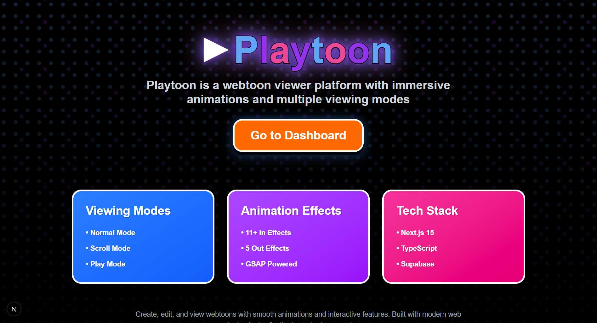
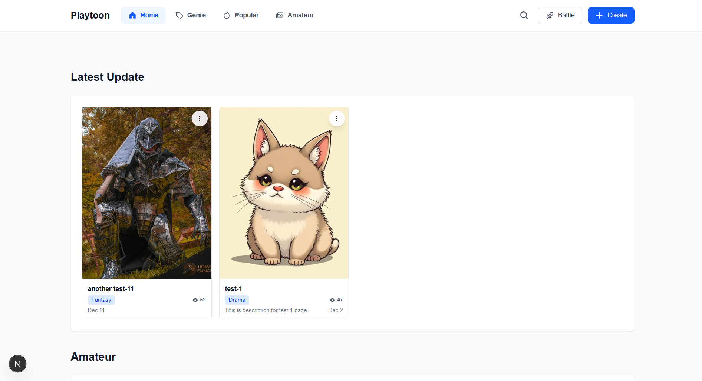
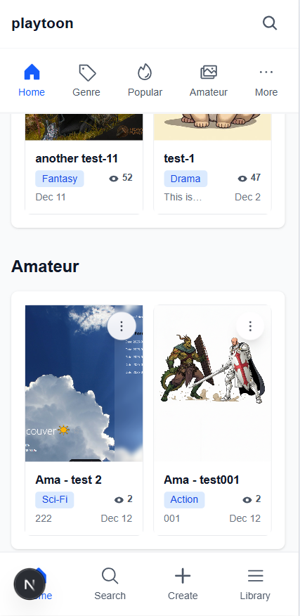
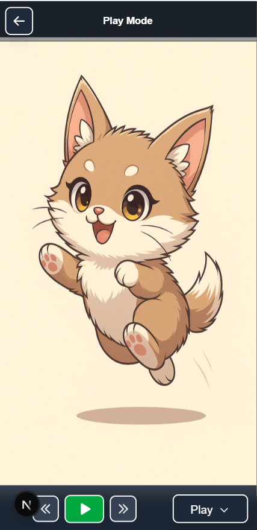

# Playtoon




Playtoon is a Next.js webtoon viewer/creator. It supports a **Series → Episodes → Cuts** structure and multiple viewing modes with GSAP-powered transitions.

## Features




### Viewing Modes

- **Normal Mode**: Traditional page-by-page navigation with thumbnail grid
- **Scroll Mode**: Continuous scrolling experience with sequential cuts
- **Play Mode**: Auto-playing animated experience with smooth transitions

### Animation Effects

- **In Effects**: Basic, Parallax, Morphing, 3D Flip, Physics, Timeline, Texture, Smooth Scroll, Blur Fade, Ripple, Shutter
- **Out Effects**: Fade Out, Zoom Out, Slide Out, Shutter Out, Slice
- Each cut can have individual animation settings

### Additional Features

- Series creation + episode creation/editing
- Image upload and management via Supabase Storage
- Persistent data storage with Supabase
- Command Battle interactive elements (testing)
- Responsive design for desktop and mobile
- Smooth animations powered by GSAP

## Tech Stack

- **Framework**: Next.js 15
- **Language**: TypeScript
- **UI**: React 19
- **Styling**: Tailwind CSS
- **Database & Storage**: Supabase (PostgreSQL + Storage)
- **Animation**: GSAP (GreenSock Animation Platform)
- **Icons**: Phosphor Icons
- **Smooth Scrolling**: Lenis

## Getting Started

### Prerequisites

- Node.js 18+
- npm or yarn
- Supabase account

### Installation

1. Install dependencies:

```bash
npm install
```

2. Set up environment variables:

Create a `.env.local` file in the root directory:

```env
NEXT_PUBLIC_SUPABASE_URL=your_supabase_url
NEXT_PUBLIC_SUPABASE_ANON_KEY=your_supabase_anon_key
```

3. Set up Supabase database:

- In Supabase Dashboard → **SQL Editor**, run the migration SQL files in this repo (if you haven't already).
- At minimum, you need tables for `series`, `episodes`, `cuts`, and `webtoon_views`, plus any related migrations in the project root (files starting with `supabase_migration_*.sql`).

4. Run the development server:

```bash
npm run dev
```

5. Open `http://localhost:3000` in your browser

## Usage

1. **Create a Series**: Create a series (title/description/thumbnail/genre)
2. **Create Episodes**: Add episodes under a series, then add cuts to episodes
3. **View**: Click an episode to open the viewer
4. **Switch Modes**: Toggle between Normal / Scroll / Play modes

## Development

```bash
# Run development server
npm run dev

# Build for production
npm run build

# Start production server
npm start

# Run linter
npm run lint
```
